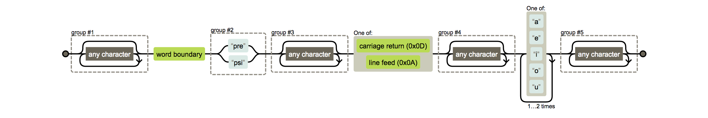

# Ejemplos de laboratorio

## Autómatas y Lenguajes Formales, 2017-2

### Lenguajes regulares

En la carpeta [`regular`](regular/) existe el archivo [`ejercicio_regex.sh`](regular/ejercicio_regex.sh), en donde
están varios ejemplos de casos de uso de los comandos `grep` y `sed`. La ejecución del archivo se puede lograr mediante
los siguientes pasos:

```bash
cd regular/
bash ejercicio_regex.sh <COMMAND> <FILE>
```

El argumento `<COMMAND>` es **obligatorio** y es con el que se le indicará al programa qué comando se desea probar.
Las opciones disponibles son las siguientes:

- _`ti`_ ejecuta `grep -E "([01][0-9]|2[0-3]):[0-5][0-9]"`; identifica horas en formato hh:mm, donde
  `00 <= hh <= 23` y `00 <= mm <= 59`.
- _`tup`_ ejecuta `sed -E "s/\(([^\(\)]*)\)/\(\1,0\)/g"`; identifica tuplas y les aumenta un cero como último
  argumento. Por ejemplo, si se le pasa la cadena `(1,2,3)`, el comando devolverá `(1,2,3,0)`.
- _`voc`_ ejecuta `grep -E "^(.*[aeiou].*)*$"`; identifica cualquier cadena con vocales en minúsculas.
- _`er`_ ejecuta `sed -E "s/\b(\w*)er\b/the more \1/g`; toma el prefijo de palabras que terminan en _er_ y lo usa
para sustituir por una frase que inicia con _the more_. Por ejemplo, cambia _larger_ por _the more large_.
- _`f1`_ ejecuta `sed -E "s/([aeiou])/\1f\1/g"`; transforma palabras (en español) a idioma de la _f_ sin manejar
	diptongos ni acentos.
- _`f2`_ ejecuta `sed -E "s/([aeiou])?([aeiou])/\1\2f\2/g""`; transforma palabras (en español) a idioma de la _f_ manejando
	diptongos pero acentos no.
- _`2l`_ ejecuta `pcregrep -M "(.*)\b(pre|psi)(.*)[\r\n](.*)[aeiou]{2,3}(.*)"`; identifica pares de líneas contiguas
  en donde la primera tiene una palabra empezando con _pre_ o _psi_ y la segunda tiene una palabra con un diptongo
  o triptongo. Se aconseja observar el comportamiento del comando con el archivo [ejemplo_lineas.txt](regular/ejemplo_lineas.txt).
  Los pares de líneas repetidas por el programa son 1-2, 7-8 y 11-12.

El argumento `<FILE>` es opcional y es una ruta hacia un archivo que se le puede pasar como argumento al comando indicado por
`<COMMAND>`. Si no se le especifica dicha ruta, el comportamiento del programa será exactamente el del comando ejecutado
correspondiente.

Se recomienda fuertemente visualizar cada expresión regular con la herramienta de [éste enlace](http://www.regexper.com). Por ejemplo,
para la expresión regular `(.*)\b(pre|psi)(.*)[\r\n](.*)[aeiou]{2,3}(.*)`, la herramienta arroja un autómata como el
siguiente:



### Máquinas de Turing

Plantilla para la práctica 3: [turing_machine.hs](recursive/turing_machine.hs). No compila así como está,
hay huecos que el alumno debe de resolver.

Una máquina de Turing está definida por la estructura

```haskell
data MT = MT { mtupla :: MaqT,
               dltfun :: Delta
             }
```

donde `mtupla` es una 6-tupla que contiene todos los alfabetos y símbolos que la definen y `dltfun` es
la función de transición. Hay varias maneras de dar explícitamente la definición de una MT en particular;
sin embargo, el siguiente ejemplo puede ayudar a tener en claro qué se espera que hagan en la práctica.
La siguiente máquina de Turing intercambia ceros por unos, y viceversa, y acepta el lenguaje `(01)+0`.

```haskell
flippingTM :: MT
flippingTM = MT (MaqT states initState acceptState rejectState inpAlphabet tapeAlphabet) deltaFun
  where
    states = ["q" ++ [c] | c <- "01fr"]
    initState = "q0"
    acceptState = "qf"
    rejectState = "qr"
    inpAlphabet = "01"
    tapeAlphabet = "01_"
    deltaFun = \q -> \a -> case (q, a) of
                             ("q0", '0') -> ("q1", '1', R)
                             ("q1", '1') -> ("q0", '0', R)
                             ("q1", '_') -> ("qf", '_', R)
                             (_, c) -> ("qr", c, R)
```

Obsérvese que la función de transición está bien definida para cualesquiera casos de `(q, a)`.

Para obtener cada uno de los elementos que consituyen, se pueden usar las funciones
`gamma`, `sigma`, `estados`, `estadoInicial`, `estadoAcept`, `estadoRechazo` y `funTransicion`. Por ejemplo,

```haskell
estados flippingTM
["q0","q1","qf","qr"]
```
